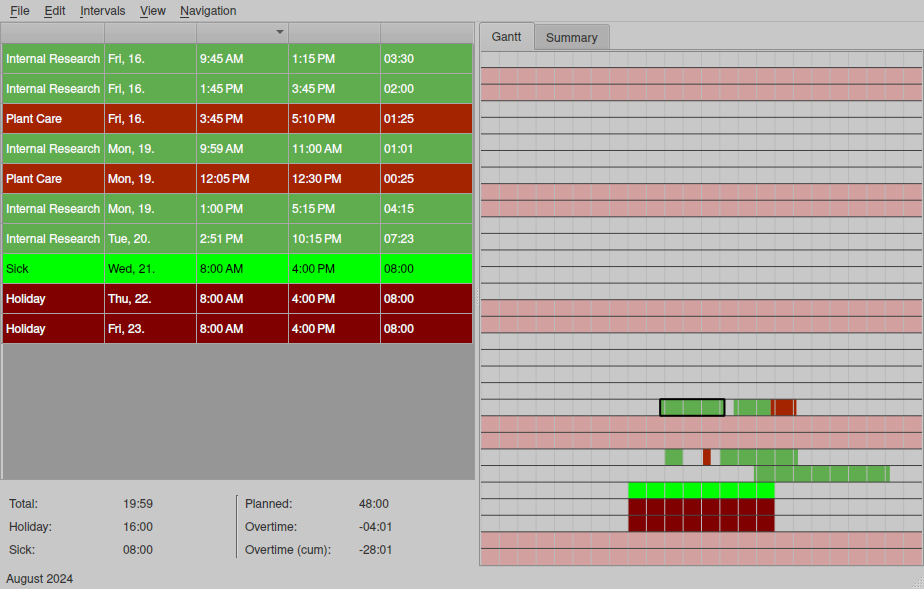

# Time Recording

I was tired of tracking my times using pen and paper of buggy excel sheets.
So I first created a a very simplistic python wrapper around a sqlite database storing all the time records (see commit eea89d6).
Though I commonly prefer CLI for simple tasks like this, I soon realized that a GUI application would be much easier to use.

The reason for this is that it is important to keep an eye on your recent time recordings.
With a good GUI, it's easy to spot and fix unfinished or ridiculous intervals (like intervals of a day or more).

## Features

- JSON files: Easy to modify manually if required.
- GUI that is optimized for speedy edits (many times a day).
- Fast start, load, save.
- Auto-assigned project colors for better overview.
- Gantt chart makes it easy to detect mistakes.
- Multiple views: Daily, Weekly, Monthly, Yearly.
- Summary view with accumulated hours for each project.
- Count overhours.
- Account for sickness and holidays.
- Key Shortcuts to navigate the database.
- Full undo/redo support.
- Convenience commands like "split interval".
- Works with light and dark themes thanks to smart color selection.
