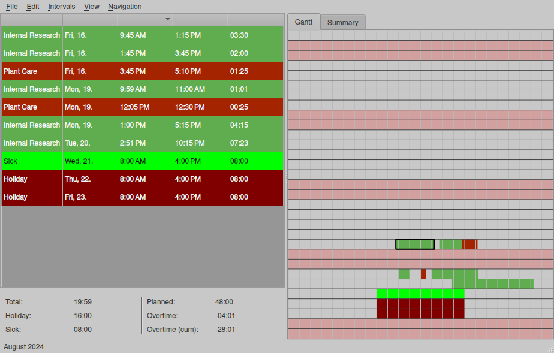

# Time Recording

I was tired of tracking my times using pen and paper of buggy excel sheets.
So I first created a a very simplistic python wrapper around a sqlite database storing all the time records (see commit eea89d6).
Though I commonly prefer CLI for simple tasks like this, I soon realized that a GUI application would be much easier to use.

The reason for this is that it is important to keep an eye on your recent time recordings.
With a good GUI, it's easy to spot and fix unfinished or ridiculous intervals (like intervals of a day or more).



## Features

- SQLite database: every edit is saved immediately, and your times are queryable with SQL.
- GUI that is optimized for speedy edits (many times a day).
- Fast start; no save step at all.
- Auto-assigned project colors for better overview.
- Gantt chart makes it easy to detect mistakes.
- Multiple views: Daily, Weekly, Monthly, Yearly.
- Summary view with accumulated hours for each project.
- Count overhours.
- Account for sickness and holidays.
- Key Shortcuts to navigate the database.
- Full undo/redo support.
- Convenience commands like "split interval".
- Works with light and dark themes thanks to smart color selection.

## Storage

TiRe keeps everything in a SQLite database at `~/.local/share/tire/tire.db`
(`QStandardPaths::AppDataLocation`; the exact directory is platform-specific). It is opened at
startup and written to as you edit, inside a transaction per undo step — so there is no Save
action, and nothing is lost if the app or the machine dies mid-edit.

Point the app at a different database with `--database`, which is handy for trying things out
without touching your real records:

```sh
tire --database /tmp/scratch.db
```

Only one instance per database runs at a time; starting a second one with the same database
raises the existing window instead.

### Querying

The schema is plain SQL, so you can report on it directly:

```sh
sqlite3 ~/.local/share/tire/tire.db "
  SELECT p.name, SUM((julianday(i.end_time) - julianday(i.begin_time)) * 24) AS hours
  FROM interval i JOIN project p ON p.id = i.project_id
  WHERE i.end_time IS NOT NULL AND i.begin_time >= '2026-01-01'
  GROUP BY p.name ORDER BY hours DESC;"
```

An interval with `end_time IS NULL` is one that is still running.

### Backups

Use SQLite's own backup command rather than copying the file:

```sh
sqlite3 ~/.local/share/tire/tire.db ".backup /path/to/backup.db"
```

The database runs in WAL mode, so recent changes may live in the `tire.db-wal` sidecar file.
Copying `tire.db` on its own while the app is running will silently miss them.
